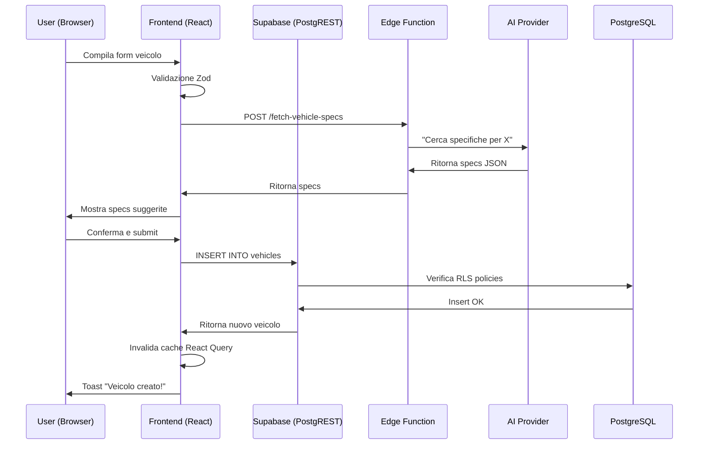
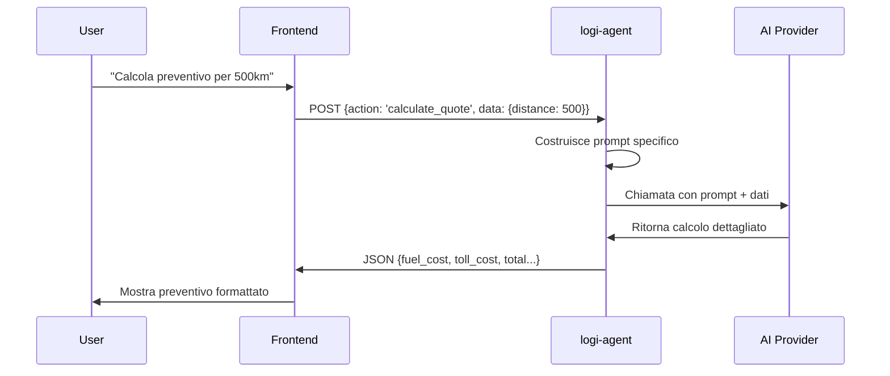

# 🏗️ LogiTrack - Architettura Completa del Progetto

**Documento Tecnico per AI e Sviluppatori**

Questo documento descrive in dettaglio OGNI aspetto del progetto LogiTrack per permettere a qualsiasi AI o sviluppatore di comprendere completamente come funziona il sistema.

---

## 📑 Indice

1. [Panoramica Generale](#panoramica-generale)
2. [Stack Tecnologico](#stack-tecnologico)
3. [Struttura Directory](#struttura-directory)
4. [Database Schema](#database-schema)
5. [Frontend Architecture](#frontend-architecture)
6. [Backend Architecture](#backend-architecture)
7. [Flusso Dati](#flusso-dati)
8. [Edge Functions](#edge-functions)
9. [Scripts e Automazione](#scripts-e-automazione)
10. [Sicurezza](#sicurezza)
11. [Deployment](#deployment)
12. [Testing](#testing)

---

## Panoramica Generale

### Cos'è LogiTrack?

LogiTrack è un **sistema completo di gestione flotte** per aziende di trasporto merci. Permette di:
- Tracciare veicoli in tempo reale su mappa
- Gestire autisti con scadenzario certificazioni
- Monitorare consumi carburante e spese
- Gestire documenti di trasporto (DDT, fatture, pedaggi)
- Ricevere suggerimenti AI per ottimizzazioni

### Architettura High-Level

```
┌─────────────────────────────────────────────────────────────┐
│                         FRONTEND                            │
│  React 18 + TypeScript + Vite + Tailwind + Shadcn UI       │
└───────────────────────┬─────────────────────────────────────┘
                        │ HTTPS/WSS
┌───────────────────────▼─────────────────────────────────────┐
│                    SUPABASE BACKEND                         │
│  ┌──────────────┐ ┌──────────────┐ ┌──────────────┐       │
│  │ PostgreSQL   │ │ Auth (JWT)   │ │ Storage (S3) │       │
│  │ + RLS        │ │ + OAuth      │ │ + Policies   │       │
│  └──────────────┘ └──────────────┘ └──────────────┘       │
│  ┌──────────────┐ ┌──────────────┐ ┌──────────────┐       │
│  │ Edge         │ │ Realtime     │ │ PostgREST    │       │
│  │ Functions    │ │ (WebSocket)  │ │ Auto API     │       │
│  └──────────────┘ └──────────────┘ └──────────────┘       │
└─────────────────────────────────────────────────────────────┘
                        │
                        ▼
┌─────────────────────────────────────────────────────────────┐
│              SERVIZI ESTERNI                                │
│  • AI Provider (Lovable/OpenAI/Google/Local)               │
│  • Mapbox (mappe GPS)                                       │
│  • CarQuery API (specifiche veicoli)                       │
└─────────────────────────────────────────────────────────────┘
```

---

## Stack Tecnologico

### Frontend
```json
{
  "framework": "React 18.3.1",
  "linguaggio": "TypeScript 5.8.3",
  "build": "Vite 5.4.19",
  "styling": "Tailwind CSS 3.4.17",
  "ui-components": "Shadcn UI (Radix UI)",
  "routing": "React Router 6.30.1",
  "state": "TanStack Query 5.83.0",
  "forms": "React Hook Form 7.61.1 + Zod 3.25.76",
  "mappe": "Mapbox GL 3.16.0",
  "charts": "Recharts 2.15.4",
  "auth": "Supabase Auth (@supabase/supabase-js 2.76.1)"
}
```

### Backend
```json
{
  "database": "PostgreSQL 15 (via Supabase)",
  "auth": "Supabase Auth (GoTrue)",
  "storage": "Supabase Storage (S3-compatible)",
  "api": "PostgREST (auto-generated from DB schema)",
  "realtime": "Supabase Realtime (WebSocket)",
  "functions": "Deno Edge Functions",
  "ai": "Multi-provider (Lovable/OpenAI/Google/Ollama)"
}
```

### DevOps
```json
{
  "containerization": "Docker + Docker Compose",
  "ci-cd": "GitHub Actions",
  "reverse-proxy": "Nginx",
  "ssl": "Let's Encrypt (Certbot)",
  "monitoring": "Prometheus + Grafana (opzionale)"
}
```

---

## Struttura Directory

```
logitrack/
├── .github/
│   └── workflows/
│       └── ci.yml                 # CI/CD pipeline (lint, test, build, docker)
├── public/
│   ├── robots.txt                 # SEO robots
│   └── assets/                    # Asset pubblici (se necessari)
├── scripts/
│   ├── seed.js                    # Popola DB con dati di esempio
│   ├── health-check.js            # Verifica stato sistema
│   ├── setup-local.js             # Setup interattivo ambiente locale
│   ├── export-storage.js          # Export file da Supabase Storage
│   └── import-storage.js          # Import file su Supabase Storage
├── src/
│   ├── assets/                    # Immagini, icone, font
│   │   └── hero-dashboard.jpg
│   ├── components/                # Componenti React
│   │   ├── ui/                    # Shadcn UI components
│   │   │   ├── button.tsx
│   │   │   ├── card.tsx
│   │   │   ├── dialog.tsx
│   │   │   └── ... (30+ componenti)
│   │   ├── dashboard/             # Componenti dashboard
│   │   │   ├── AIAssistant.tsx           # Chat AI per suggerimenti
│   │   │   ├── DashboardStats.tsx        # Card statistiche principali
│   │   │   ├── FleetOverview.tsx         # Tabella veicoli
│   │   │   ├── FuelConsumption.tsx       # Grafici consumi
│   │   │   └── RecentTrips.tsx           # Lista viaggi recenti
│   │   ├── fleet/                 # Gestione flotta
│   │   │   └── VehicleFormDialog.tsx     # Form crea/modifica veicolo
│   │   ├── fleet-detail/          # Dettaglio veicolo
│   │   │   ├── VehicleOverview.tsx       # Info generali veicolo
│   │   │   ├── DriverAssignments.tsx     # Assegnazioni autista
│   │   │   ├── MaintenanceHistory.tsx    # Storico manutenzioni
│   │   │   ├── FuelAnalysis.tsx          # Analisi consumi
│   │   │   ├── KilometerHistory.tsx      # Storico chilometraggio
│   │   │   ├── ExpensesBreakdown.tsx     # Dettaglio spese
│   │   │   └── DocumentsList.tsx         # Documenti veicolo
│   │   ├── drivers/               # Gestione autisti
│   │   │   └── AssignExtraStaffDialog.tsx
│   │   ├── tracking/              # Tracking GPS
│   │   │   ├── MapView.tsx               # Mappa Mapbox interattiva
│   │   │   ├── VehicleSelector.tsx       # Selettore veicolo
│   │   │   └── KilometerStats.tsx        # Statistiche km
│   │   ├── notifications/
│   │   │   └── NotificationBell.tsx      # Campana notifiche
│   │   ├── ProtectedRoute.tsx     # HOC per route protette
│   │   └── ErrorBoundary.tsx      # Gestione errori React
│   ├── hooks/
│   │   ├── useAuth.tsx            # Hook autenticazione
│   │   ├── use-mobile.tsx         # Detect mobile device
│   │   └── use-toast.ts           # Hook per toast notifications
│   ├── integrations/
│   │   └── supabase/
│   │       ├── client.ts          # Client Supabase (auto-generated)
│   │       └── types.ts           # TypeScript types DB (auto-generated)
│   ├── lib/
│   │   └── utils.ts               # Utility functions (cn, ecc.)
│   ├── pages/                     # Pagine principali
│   │   ├── Auth.tsx               # Login/Signup
│   │   ├── Dashboard.tsx          # Dashboard principale
│   │   ├── Fleet.tsx              # Elenco veicoli
│   │   ├── FleetDetail.tsx        # Dettaglio singolo veicolo
│   │   ├── Drivers.tsx            # Gestione autisti
│   │   ├── Orders.tsx             # Gestione ordini/viaggi
│   │   ├── LiveTracking.tsx       # Mappa tracking tempo reale
│   │   ├── FuelConsumptionAnalysis.tsx  # Analisi consumi
│   │   ├── Settings.tsx           # Impostazioni utente
│   │   └── NotFound.tsx           # 404 page
│   ├── App.tsx                    # Root component + routing
│   ├── App.css                    # Stili globali aggiuntivi
│   ├── index.css                  # Design system + Tailwind base
│   ├── main.tsx                   # Entry point React
│   └── vite-env.d.ts              # Vite type definitions
├── supabase/
│   ├── functions/                 # Edge Functions (Deno)
│   │   ├── _shared/               # Codice condiviso
│   │   │   ├── ai-provider.ts            # Wrapper multi-AI provider
│   │   │   └── cors.ts                   # Gestione CORS
│   │   ├── logi-agent/
│   │   │   └── index.ts           # AI Assistant principale
│   │   ├── fetch-vehicle-specs/
│   │   │   └── index.ts           # Recupera specifiche veicolo
│   │   ├── get-vehicle-models/
│   │   │   └── index.ts           # Lista modelli per marca
│   │   ├── process-document/
│   │   │   └── index.ts           # OCR/estrazione dati documenti
│   │   ├── check-deadlines/
│   │   │   └── index.ts           # Verifica scadenze e notifiche
│   │   └── setup-admin/
│   │       └── index.ts           # Crea utente admin iniziale
│   ├── migrations/                # Migrazioni database SQL
│   │   └── *.sql                  # File migrazione timestampati
│   └── config.toml                # Configurazione Supabase
├── .env                           # Variabili ambiente (NON committare)
├── .env.example                   # Template variabili ambiente
├── .gitignore                     # File ignorati da Git
├── Dockerfile                     # Container produzione
├── docker-compose.yml             # Stack Docker dev
├── docker-compose.prod.yml        # Stack Docker production
├── nginx.conf                     # Configurazione Nginx
├── kong.yml                       # Configurazione Kong API Gateway
├── tailwind.config.ts             # Configurazione Tailwind
├── vite.config.ts                 # Configurazione Vite
├── tsconfig.json                  # TypeScript config
├── package.json                   # Dipendenze npm
├── README.md                      # Guida setup e utilizzo
├── MIGRATION.md                   # Guida migrazione da Lovable
├── DEPLOYMENT.md                  # Guida deployment VPS/cloud
└── PROJECT_ARCHITECTURE.md        # Questo file
```

---

## Database Schema

### Tabelle Principali

#### `profiles`
```sql
CREATE TABLE public.profiles (
  id UUID PRIMARY KEY REFERENCES auth.users(id),
  email TEXT NOT NULL UNIQUE,
  username TEXT UNIQUE,
  first_name TEXT,
  last_name TEXT,
  avatar_url TEXT,
  created_at TIMESTAMPTZ DEFAULT NOW(),
  updated_at TIMESTAMPTZ DEFAULT NOW()
);
```
**Scopo**: Informazioni utente aggiuntive (estende auth.users)

#### `user_roles`
```sql
CREATE TABLE public.user_roles (
  id UUID PRIMARY KEY DEFAULT gen_random_uuid(),
  user_id UUID NOT NULL REFERENCES auth.users(id),
  role app_role NOT NULL,  -- ENUM: admin, manager, driver
  created_at TIMESTAMPTZ DEFAULT NOW(),
  UNIQUE(user_id, role)
);
```
**Scopo**: Gestione ruoli utente per RBAC

#### `vehicles`
```sql
CREATE TABLE public.vehicles (
  id UUID PRIMARY KEY DEFAULT gen_random_uuid(),
  license_plate TEXT NOT NULL UNIQUE,
  brand TEXT NOT NULL,
  model TEXT NOT NULL,
  year INTEGER NOT NULL,
  vehicle_type vehicle_type NOT NULL,  -- truck, van, trailer
  fuel_type fuel_type NOT NULL,  -- diesel, gasoline, electric, hybrid
  status vehicle_status DEFAULT 'available',  -- available, in_use, maintenance, out_of_service
  
  -- Specifiche tecniche
  engine_displacement INTEGER,  -- cc
  horsepower INTEGER,  -- HP
  torque INTEGER,  -- Nm
  max_load_capacity INTEGER,  -- kg
  consumption_highway DECIMAL(5,2),  -- L/100km
  consumption_city DECIMAL(5,2),
  consumption_mixed DECIMAL(5,2),
  consumption_data_source TEXT,  -- 'carquery', 'ai', 'manual'
  length_mm INTEGER,
  width_mm INTEGER,
  height_mm INTEGER,
  euro_emission_standard TEXT,
  
  -- Documenti
  insurance_expiry DATE,
  inspection_expiry DATE,
  tax_expiry DATE,
  
  -- Tracking
  current_km INTEGER DEFAULT 0,
  last_maintenance_km INTEGER,
  last_maintenance_date DATE,
  
  created_at TIMESTAMPTZ DEFAULT NOW(),
  updated_at TIMESTAMPTZ DEFAULT NOW()
);
```
**Scopo**: Anagrafica veicoli con specifiche tecniche

#### `drivers`
```sql
CREATE TABLE public.drivers (
  id UUID PRIMARY KEY DEFAULT gen_random_uuid(),
  first_name TEXT NOT NULL,
  last_name TEXT NOT NULL,
  phone TEXT,
  email TEXT,
  license_number TEXT NOT NULL UNIQUE,
  license_expiry DATE NOT NULL,
  cqc_expiry DATE,  -- Carta Qualificazione Conducente
  medical_cert_expiry DATE,
  adr_cert_expiry DATE,  -- Trasporto merci pericolose
  status driver_status DEFAULT 'available',  -- available, on_trip, off_duty, unavailable
  created_at TIMESTAMPTZ DEFAULT NOW(),
  updated_at TIMESTAMPTZ DEFAULT NOW()
);
```
**Scopo**: Anagrafica autisti con certificazioni

#### `driver_assignments`
```sql
CREATE TABLE public.driver_assignments (
  id UUID PRIMARY KEY DEFAULT gen_random_uuid(),
  vehicle_id UUID NOT NULL REFERENCES vehicles(id),
  driver_id UUID NOT NULL REFERENCES drivers(id),
  assignment_type assignment_type NOT NULL,  -- primary, backup, temporary
  assigned_at TIMESTAMPTZ DEFAULT NOW(),
  unassigned_at TIMESTAMPTZ,
  notes TEXT
);
```
**Scopo**: Assegnazione autisti a veicoli

#### `trips`
```sql
CREATE TABLE public.trips (
  id UUID PRIMARY KEY DEFAULT gen_random_uuid(),
  vehicle_id UUID NOT NULL REFERENCES vehicles(id),
  driver_id UUID NOT NULL REFERENCES drivers(id),
  
  start_location TEXT NOT NULL,
  end_location TEXT NOT NULL,
  start_time TIMESTAMPTZ NOT NULL,
  end_time TIMESTAMPTZ,
  
  distance_km DECIMAL(10,2),
  fuel_consumed_liters DECIMAL(10,2),
  average_consumption DECIMAL(5,2),  -- L/100km
  
  status trip_status DEFAULT 'planned',  -- planned, in_progress, completed, cancelled
  
  -- GPS tracking
  route_geometry JSONB,  -- GeoJSON LineString
  
  created_at TIMESTAMPTZ DEFAULT NOW(),
  updated_at TIMESTAMPTZ DEFAULT NOW()
);
```
**Scopo**: Registro viaggi effettuati

#### `expenses`
```sql
CREATE TABLE public.expenses (
  id UUID PRIMARY KEY DEFAULT gen_random_uuid(),
  vehicle_id UUID REFERENCES vehicles(id),
  driver_id UUID REFERENCES drivers(id),
  trip_id UUID REFERENCES trips(id),
  
  expense_type expense_type NOT NULL,  -- fuel, maintenance, toll, parking, fine, insurance, other
  amount DECIMAL(10,2) NOT NULL,
  currency TEXT DEFAULT 'EUR',
  
  date DATE NOT NULL,
  description TEXT,
  notes TEXT,
  
  -- Metadata
  payment_method TEXT,  -- cash, card, company_account
  receipt_url TEXT,
  
  created_at TIMESTAMPTZ DEFAULT NOW()
);
```
**Scopo**: Tracciamento spese operative

#### `documents`
```sql
CREATE TABLE public.documents (
  id UUID PRIMARY KEY DEFAULT gen_random_uuid(),
  vehicle_id UUID REFERENCES vehicles(id),
  driver_id UUID REFERENCES drivers(id),
  trip_id UUID REFERENCES trips(id),
  
  type document_type NOT NULL,  -- ddt, fuel_invoice, toll_receipt, maintenance_invoice, insurance, other
  file_name TEXT NOT NULL,
  file_url TEXT NOT NULL,
  file_size INTEGER,
  
  document_number TEXT,
  date DATE,
  
  status document_status DEFAULT 'pending',  -- pending, processed, verified, rejected
  extracted_data JSONB,  -- Dati estratti da AI/OCR
  
  uploaded_by UUID REFERENCES auth.users(id),
  created_at TIMESTAMPTZ DEFAULT NOW()
);
```
**Scopo**: Gestione documenti digitalizzati

#### `maintenance_records`
```sql
CREATE TABLE public.maintenance_records (
  id UUID PRIMARY KEY DEFAULT gen_random_uuid(),
  vehicle_id UUID NOT NULL REFERENCES vehicles(id),
  
  date DATE NOT NULL,
  km_at_maintenance INTEGER NOT NULL,
  
  type maintenance_type NOT NULL,  -- ordinary, extraordinary, repair
  description TEXT NOT NULL,
  cost DECIMAL(10,2),
  
  performed_by TEXT,  -- Officina/meccanico
  next_maintenance_km INTEGER,
  next_maintenance_date DATE,
  
  parts_replaced TEXT[],
  
  created_at TIMESTAMPTZ DEFAULT NOW()
);
```
**Scopo**: Storico manutenzioni veicoli

#### `notifications`
```sql
CREATE TABLE public.notifications (
  id UUID PRIMARY KEY DEFAULT gen_random_uuid(),
  user_id UUID NOT NULL REFERENCES auth.users(id),
  
  type notification_type NOT NULL,  -- info, warning, alert, deadline
  title TEXT NOT NULL,
  message TEXT NOT NULL,
  priority notification_priority DEFAULT 'medium',  -- low, medium, high, urgent
  
  read BOOLEAN DEFAULT FALSE,
  read_at TIMESTAMPTZ,
  
  related_entity_type TEXT,  -- vehicle, driver, trip, document
  related_entity_id UUID,
  
  created_at TIMESTAMPTZ DEFAULT NOW()
);
```
**Scopo**: Sistema notifiche in-app

### Row Level Security (RLS)

**TUTTE** le tabelle hanno RLS abilitato. Esempi di policies:

```sql
-- I manager vedono tutti i veicoli della loro azienda
CREATE POLICY "Managers can view all vehicles"
ON vehicles FOR SELECT
TO authenticated
USING (
  EXISTS (
    SELECT 1 FROM user_roles
    WHERE user_id = auth.uid()
    AND role IN ('admin', 'manager')
  )
);

-- Gli autisti vedono solo i veicoli assegnati a loro
CREATE POLICY "Drivers can view assigned vehicles"
ON vehicles FOR SELECT
TO authenticated
USING (
  EXISTS (
    SELECT 1 FROM driver_assignments da
    JOIN drivers d ON d.id = da.driver_id
    WHERE da.vehicle_id = vehicles.id
    AND d.email = auth.jwt()->>'email'
  )
);
```

---

## Frontend Architecture

### Routing (React Router)

```tsx
// src/App.tsx
<Routes>
  <Route path="/auth" element={<Auth />} />
  
  <Route element={<ProtectedRoute />}>
    <Route path="/" element={<Dashboard />} />
    <Route path="/fleet" element={<Fleet />} />
    <Route path="/fleet/:id" element={<FleetDetail />} />
    <Route path="/drivers" element={<Drivers />} />
    <Route path="/orders" element={<Orders />} />
    <Route path="/tracking" element={<LiveTracking />} />
    <Route path="/fuel-analysis" element={<FuelConsumptionAnalysis />} />
    <Route path="/settings" element={<Settings />} />
  </Route>
  
  <Route path="*" element={<NotFound />} />
</Routes>
```

### State Management

**TanStack Query** per server state:

```tsx
// Esempio: Fetch veicoli
const { data: vehicles, isLoading } = useQuery({
  queryKey: ['vehicles'],
  queryFn: async () => {
    const { data, error } = await supabase
      .from('vehicles')
      .select('*')
      .order('created_at', { ascending: false });
    
    if (error) throw error;
    return data;
  }
});
```

**React Hook Form + Zod** per form state:

```tsx
const formSchema = z.object({
  license_plate: z.string().min(6),
  brand: z.string().min(1),
  model: z.string().min(1),
});

const form = useForm<z.infer<typeof formSchema>>({
  resolver: zodResolver(formSchema),
});
```

### Design System (Tailwind + CSS Variables)

Tutti i colori sono definiti in `src/index.css` come HSL variables:

```css
:root {
  --background: 0 0% 100%;
  --foreground: 222.2 84% 4.9%;
  --primary: 221.2 83.2% 53.3%;
  --primary-foreground: 210 40% 98%;
  /* ... */
}

.dark {
  --background: 222.2 84% 4.9%;
  --foreground: 210 40% 98%;
  /* ... */
}
```

Uso nei componenti:
```tsx
<div className="bg-background text-foreground">
  <Button variant="default">Click</Button>
</div>
```

### Realtime Updates

```tsx
useEffect(() => {
  const channel = supabase
    .channel('vehicles-changes')
    .on(
      'postgres_changes',
      {
        event: '*',
        schema: 'public',
        table: 'vehicles'
      },
      (payload) => {
        queryClient.invalidateQueries(['vehicles']);
      }
    )
    .subscribe();

  return () => {
    supabase.removeChannel(channel);
  };
}, []);
```

---

## Backend Architecture

### Edge Functions (Deno)

Tutte le edge functions seguono questa struttura:

```typescript
// Imports
import { serve } from "https://deno.land/std@0.168.0/http/server.ts";
import { callAI } from "../_shared/ai-provider.ts";
import { handleCorsPreflightRequest, createCorsResponse } from "../_shared/cors.ts";

// Handler
serve(async (req) => {
  // CORS preflight
  if (req.method === 'OPTIONS') {
    return handleCorsPreflightRequest();
  }

  try {
    // Parsing request
    const { param1, param2 } = await req.json();
    
    // Business logic
    const result = await someLogic(param1, param2);
    
    // Response
    return createCorsResponse({ success: true, data: result });
  } catch (error) {
    return createErrorResponse(error.message, 500);
  }
});
```

### AI Provider Abstraction

Il file `_shared/ai-provider.ts` astrae chiamate AI:

```typescript
// Configurazione in .env:
AI_PROVIDER=openai  // o lovable, google, local

// Utilizzo in edge functions:
const response = await callAI([
  { role: 'system', content: 'Sei un assistente...' },
  { role: 'user', content: 'Domanda utente' }
], {
  temperature: 0.7,
  max_tokens: 2000
});

// Funziona automaticamente con qualsiasi provider configurato!
```

---

## Flusso Dati

### Esempio: Creazione Nuovo Veicolo



### Esempio: AI Assistant



---

## Edge Functions Dettaglio

### logi-agent (AI Assistant)

**File**: `supabase/functions/logi-agent/index.ts`

**Azioni supportate**:
- `calculate_quote`: Calcola preventivo trasporto
- `analyze_expenses`: Analisi finanziaria spese
- `suggest_maintenance`: Suggerimenti manutenzione predittiva
- `optimize_assignment`: Ottimizza assegnazione veicolo-autista
- `check_deadlines`: Gestione scadenze
- default: Assistenza generale

**Come funziona**:
1. Riceve `{action, data}` in POST
2. Switch su action → costruisce system prompt specifico
3. Chiama `callAI()` con prompt
4. Ritorna risposta AI formattata

### fetch-vehicle-specs

**File**: `supabase/functions/fetch-vehicle-specs/index.ts`

**Scopo**: Recupera specifiche tecniche veicolo da CarQuery API o AI

**Flusso**:
1. Riceve marca, modello, anno (opzionali)
2. Se `source=carquery`: chiama CarQuery API
3. Se `source=ai`: chiama AI per lookup
4. Se `source=both`: confronta entrambe le fonti
5. Ritorna specifiche (consumo, potenza, cilindrata, ecc.)

### process-document

**File**: `supabase/functions/process-document/index.ts`

**Scopo**: Estrae dati da documenti caricati (OCR simulato con AI)

**Flusso**:
1. Riceve `documentId` e `fileUrl`
2. Recupera info documento da DB
3. Costruisce prompt specifico per tipo documento (DDT, fattura, ecc.)
4. Chiama AI per estrazione dati
5. Parsa risposta JSON
6. Aggiorna `documents.extracted_data` in DB
7. Cambia status a 'processed'

### check-deadlines

**File**: `supabase/functions/check-deadlines/index.ts`

**Scopo**: Verifica scadenze e crea notifiche automatiche

**Flusso**:
1. Eseguita via cron (es: ogni giorno alle 06:00)
2. Calcola date soglia (7, 30, 60 giorni)
3. Query veicoli con scadenze vicine (assicurazione, revisione, bollo)
4. Query autisti con certificazioni in scadenza
5. Crea notifiche in `notifications` table
6. Assegna priorità (high, medium, low)
7. Ritorna numero notifiche create

---

## Scripts e Automazione

### seed.js

**Scopo**: Popola database con dati esempio

**Cosa crea**:
- Utente admin (`admin@logitrack.demo` / `Admin123!`)
- 3 veicoli esempio (Mercedes, Iveco, Scania)
- 2 autisti esempio
- 1 assegnazione autista-veicolo

**Uso**: `npm run seed`

### health-check.js

**Scopo**: Verifica stato configurazione e connessioni

**Controlli**:
- ✅ Variabili ENV obbligatorie presenti
- ✅ Connessione Supabase funzionante
- ✅ AI provider configurato correttamente
- ✅ Mapbox token valido (opzionale)

**Output**: Report dettagliato con errori/warning

**Uso**: `npm run health-check`

### export-storage.js

**Scopo**: Backup completo Supabase Storage

**Flusso**:
1. Lista tutti i bucket
2. Per ogni bucket, scarica ricorsivamente tutti i file
3. Salva in `storage-backup/backup-TIMESTAMP/`
4. Esporta metadata bucket in JSON
5. Report statistiche (file scaricati, dimensione totale)

**Uso**: `npm run export:storage`

### import-storage.js

**Scopo**: Ripristina backup Storage su nuovo progetto

**Flusso**:
1. Mostra backup disponibili
2. Utente seleziona backup da importare
3. Legge metadata.json
4. Crea bucket se non esistono
5. Carica ricorsivamente tutti i file
6. Report finale (file caricati, falliti)

**Uso**: `npm run import:storage`

### setup-local.js

**Scopo**: Setup interattivo guidato

**Domande**:
- Credenziali Supabase
- AI provider preferito + API key
- Token Mapbox
- URL applicazione

**Output**: File `.env` configurato pronto all'uso

**Uso**: `npm run setup:local`

---

## Sicurezza

### Autenticazione

- **JWT tokens** gestiti da Supabase Auth
- **Session storage** in localStorage
- **Auto-refresh** token prima scadenza
- **Protected routes** via HOC ProtectedRoute

### Autorizzazione (RBAC)

Ruoli disponibili:
- `admin`: Accesso completo
- `manager`: Gestione flotta e autisti
- `driver`: Solo visualizzazione assegnazioni proprie

Verifica ruoli:
```sql
CREATE FUNCTION has_role(user_id UUID, role app_role)
RETURNS BOOLEAN AS $$
  SELECT EXISTS (
    SELECT 1 FROM user_roles
    WHERE user_id = $1 AND role = $2
  );
$$ LANGUAGE SQL STABLE;
```

### Row Level Security (RLS)

**TUTTE** le tabelle hanno RLS abilitato:
```sql
ALTER TABLE vehicles ENABLE ROW LEVEL SECURITY;
ALTER TABLE drivers ENABLE ROW LEVEL SECURITY;
-- ... per tutte le tabelle
```

Policies esempio:
```sql
-- Solo admin/manager possono inserire veicoli
CREATE POLICY "Only managers can insert vehicles"
ON vehicles FOR INSERT
TO authenticated
WITH CHECK (
  EXISTS (
    SELECT 1 FROM user_roles
    WHERE user_id = auth.uid()
    AND role IN ('admin', 'manager')
  )
);
```

### Secrets Management

- **Service keys** mai esposti al client
- **API keys** gestiti via Supabase Secrets
- **Environment variables** separate per env (dev/staging/prod)
- **.env** mai committato in Git (`.gitignore`)

### CORS

Configurazione centralizzata in `_shared/cors.ts`:
```typescript
const allowedOrigins = Deno.env.get('ALLOWED_ORIGINS') || '*';
```

Produzione: `ALLOWED_ORIGINS=https://app.logitrack.com`

---

## Deployment

### Opzioni Disponibili

1. **VPS Self-Hosted** (DigitalOcean, Hetzner, Linode)
   - Controllo completo
   - Costo fisso mensile
   - Richiede manutenzione
   - Guida: `DEPLOYMENT.md`

2. **Cloud Managed** (Vercel, Netlify, Railway, Fly.io)
   - Deploy automatico da Git
   - Scaling automatico
   - Pay-per-use
   - Setup rapido

3. **Docker** (Locale o cloud)
   - `docker-compose.yml` per dev
   - `docker-compose.prod.yml` per produzione
   - Portabile ovunque

4. **Kubernetes** (Advanced)
   - Per grandi scale
   - Auto-healing
   - Load balancing
   - Manifests in `k8s/` (da creare)

### Variabili Ambiente Obbligatorie

```env
# Supabase
VITE_SUPABASE_URL=https://xxx.supabase.co
VITE_SUPABASE_PUBLISHABLE_KEY=eyJ...
VITE_SUPABASE_PROJECT_ID=xxx

# AI (uno dei seguenti)
AI_PROVIDER=openai
OPENAI_API_KEY=sk-...

# App
VITE_APP_URL=https://app.logitrack.com
NODE_ENV=production
```

---

## Testing

### Test Suite (Da Implementare)

```bash
npm run test              # Run test suite
npm run test:ui           # Vitest UI
npm run test:e2e          # Playwright E2E
```

### Health Check in Produzione

```bash
curl https://app.logitrack.com/health
# Output: "healthy"
```

### Smoke Tests

```bash
# Test login
curl -X POST https://your-api/auth/login \
  -d '{"email":"test@test.com","password":"test123"}'

# Test edge function
curl -X POST https://your-api/functions/v1/logi-agent \
  -H "Authorization: Bearer $TOKEN" \
  -d '{"action":"calculate_quote","data":{"distance":100}}'
```

---

## Convenzioni Codice

### Naming

- **Componenti**: PascalCase (`VehicleCard.tsx`)
- **Funzioni/variabili**: camelCase (`getUserData()`)
- **Costanti**: UPPER_SNAKE_CASE (`API_BASE_URL`)
- **CSS classes**: kebab-case (`card-header`)
- **DB tables**: snake_case (`driver_assignments`)

### Import Order

```typescript
// 1. External libraries
import React from 'react';
import { useQuery } from '@tanstack/react-query';

// 2. Internal utilities
import { supabase } from '@/integrations/supabase/client';
import { cn } from '@/lib/utils';

// 3. Components
import { Button } from '@/components/ui/button';
import { Card } from '@/components/ui/card';

// 4. Types
import type { Vehicle } from '@/integrations/supabase/types';

// 5. Styles (if needed)
import './styles.css';
```

### Error Handling

```typescript
// Frontend
try {
  const { data, error } = await supabase...
  if (error) throw error;
  return data;
} catch (error) {
  toast.error("Errore: " + error.message);
  console.error(error);
}

// Edge Functions
try {
  // logic
  return createCorsResponse({ success: true, data });
} catch (error) {
  console.error('[FunctionName] Error:', error);
  return createErrorResponse(error.message, 500);
}
```

---

## Performance

### Ottimizzazioni Frontend

- **Code splitting**: Routes lazy-loaded
- **Image optimization**: WebP, lazy loading
- **Bundle analysis**: `npm run build --analyze`
- **Caching**: React Query stale time 5 min
- **Debouncing**: Search inputs 300ms delay

### Ottimizzazioni Database

- **Indexes**: Su foreign keys e colonne filtrate
- **Materialized views**: Per query complesse frequenti
- **Connection pooling**: PgBouncer configurato
- **Query optimization**: EXPLAIN ANALYZE su slow queries

---

## Troubleshooting Comune

### Build Fails

```bash
rm -rf node_modules dist .vite
npm install
npm run build
```

### Database Connection Error

```bash
# Verifica credenziali
echo $VITE_SUPABASE_URL

# Test connessione
psql $SUPABASE_DB_URL

# Check RLS policies
npm run supabase:linter
```

### AI Provider Error

```bash
# Verifica API key configurata
echo $OPENAI_API_KEY

# Test diretto
curl https://api.openai.com/v1/models \
  -H "Authorization: Bearer $OPENAI_API_KEY"
```

### Mapbox Not Loading

```bash
# Verifica token
echo $VITE_MAPBOX_TOKEN

# Check browser console per CORS errors
```

---

## Estensioni Future

### Roadmap Possibile

- [ ] **App Mobile** (React Native)
- [ ] **Webhook integrations** (Slack, Telegram notifiche)
- [ ] **Advanced analytics** (Predizioni ML consumo)
- [ ] **Multi-tenancy** (Supporto più aziende)
- [ ] **API pubblica** (REST API per integrazioni terze)
- [ ] **White-label** (Personalizzazione branding)
- [ ] **Offline mode** (PWA con Service Worker)
- [ ] **IoT integration** (Telemetria real-time da veicoli)

---

## Risorse Utili

### Documentazione Esterna

- [Supabase Docs](https://supabase.com/docs)
- [React Docs](https://react.dev)
- [Tailwind CSS](https://tailwindcss.com/docs)
- [Shadcn UI](https://ui.shadcn.com/)
- [TanStack Query](https://tanstack.com/query/latest)
- [Mapbox GL JS](https://docs.mapbox.com/mapbox-gl-js/)

### Community

- **Discord**: [Join LogiTrack Community](#)
- **GitHub Discussions**: [Ask Questions](#)
- **Email Support**: support@logitrack.ai

---

## Conclusione

Questo documento contiene **TUTTO** quello che un AI o sviluppatore deve sapere per lavorare su LogiTrack. Include:

✅ Architettura completa  
✅ Schema database dettagliato  
✅ Spiegazione ogni componente  
✅ Flussi dati illustrati  
✅ Edge functions documentate  
✅ Scripts automazione spiegati  
✅ Sicurezza e best practices  
✅ Guide deployment  
✅ Troubleshooting comune  

Per domande specifiche, consultare:
- `README.md` per quick start
- `MIGRATION.md` per migrare da Lovable
- `DEPLOYMENT.md` per deploy VPS/cloud

**Buon coding! 🚀**
